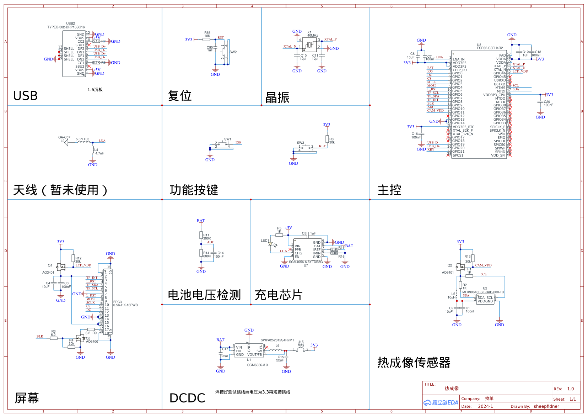

# ESP32S3_Touchscreen_Thermal
为启凡-找羊科创设计的热成像仪提供开源的软件实现。

探头型号：MLX90640 分辨率 24 * 32
## 用法：
- 右上角 按钮 静止画面。
- 左下角 按钮 按下开启。
- 右下角 按钮 长按关闭。
- 触屏按下对画面进行点测温。
- 触屏长按上下滑动调节亮度。
- 右下角 按钮 短按开启 / 关闭点测温。


## 怎么在`platformio`中配置这个单片机信息

`C:\Users\<username>\.platformio\platforms\espressif32\boards\esp32-s3-fh4r2.json`

```json
{
    "build": {
      "arduino":{
        "partitions": "default.csv",
        "memory_type": "qio_qspi"
      },
      "core": "esp32",
      "extra_flags": [
        "-DARDUINO_ESP32S3_DEV",
        "-DARDUINO_RUNNING_CORE=1",
        "-DARDUINO_EVENT_RUNNING_CORE=1",
        "-DARDUINO_USB_CDC_ON_BOOT=1",
        "-DBOARD_HAS_PSRAM"
      ],
      "f_cpu": "240000000L",
      "f_flash": "80000000L",
      "flash_mode": "qio",
      "psram_type": "qio",
      "hwids": [
        [
          "0x303A",
          "0x1001"
        ]
      ],
      "mcu": "esp32s3",
      "variant": "esp32s3"
    },
    "connectivity": [
      "wifi",
      "bluetooth"
    ],
    "debug": {
      "default_tool": "esp-builtin",
      "onboard_tools": [
        "esp-builtin"
      ],
      "openocd_target": "esp32s3.cfg"
    },
    "frameworks": [
      "arduino",
      "espidf"
    ],
    "platforms" : [
      "espressif32"
    ],
    "name": "Espressif ESP32-S3-FH4R2 (4 MB QD, 2MB PSRAM)",
    "upload": {
      "flash_size": "4MB",
      "maximum_ram_size": 327680,
      "maximum_size": 4194304,
      "require_upload_port": true,
      "speed": 921600
    },
    "url": "https://docs.espressif.com/projects/esp-idf/en/latest/esp32s3/hw-reference/esp32s3/user-guide-devkitc-1.html",
    "vendor": "Espressif"
  }
```

复制以下文件到指定目录中

`./assets/***.h` -> `./.pio/libdeps/esp32-s3-fh4r2/TFT_eSPI/`



